# Navigation
Organisation - https://github.com/SupaGift
Front - this repo
Docs - https://github.com/supagift/core
---

# SupaGift 🎁

---

## Table of Contents
1. Quick Start
2. Tech Stack
3. Folder Structure & DDD Layers
4. Domain Model
5. Sender Flow (UX & Code Walk-Through)
6. Receiver Flow (UX & Code Walk-Through)
7. On-chain Payment Lifecycle
8. Environment Variables
9. NPM Scripts
10. Deployment (Vercel ✈️)
11. Backlog / Inactive Buttons

---

## 1  Quick Start


```bash
git clone https://github.com/your-org/breakout-gifts.git
cd breakout-gifts
cp .env.example .env.local            # fill creds – see §8
npm i
npm run dev
```

Open http://localhost:3000 and create your first gift.

---

## 2  Tech Stack

| Layer          | Library / Service                      |
| -------------- | -------------------------------------- |
| Front-end      | Next.js 14 (App Router) + Tailwind CSS |
| Auth & Wallets | `@privy-io/react-auth`                 |
| Database       | Supabase (PostgreSQL + Realtime)       |
| Edge Fns       | Supabase Edge Functions (TypeScript)   |
| Blockchain     | Solana (`@solana/web3.js`)             |
| Payments       | Solana Pay (`@solana/pay`) + QRCode    |
| Forms/Validation | React Hook Form + Zod                |

---

## 3  Domain Model

### `gifts` table

| column            | type      | purpose                           |
| ----------------- | --------- | --------------------------------- |
| `id` (pk)         | `uuid`    | Internal DB id                    |
| `gift_id`         | `text`    | Public, embedded in link / QR     |
| `sender_email`    | `text`    | Bound to Privy identity           |
| `receiver_email`  | `text`    | Gift recipient                    |
| `receiver_wallet` | `text`    | Privy auto-generated wallet       |
| `amount`          | `numeric` | Gift size (SOL)                   |
| `token`           | `text`    | `SOL` or `USDC`                   |
| `status`          | `text`    | `pending` ➜ `paid` ➜ `claimed`    |
| `claimed`         | `ts`      | When receiver clicked *Claim*     |
| `last_update`     | `ts`      | Row audit                         |
| `is_staked`       | `bool`    | Placeholder (inactive)            |

A minimal `users` table stores `{ email, wallet }` for analytics.

---


## 4  Sender Flow 🔄


| Page                 | Component                                   | Key Logic |
| -------------------- | ------------------------------------------- | --------- |
| `/sender/amount`     | `AmountPage.tsx`                            | React Hook Form + Zod – stores amount in `SenderFlowContext` |
| `/sender/type`       | `TypePage.tsx`                              | Select ⬩ Token ⬩ Staking* ⬩ NFT* |
| `/sender/checkout`   | `CheckoutPage.tsx`                          | Calls **Supabase Edge Fn** ➜ creates Privy wallet for receiver & `gifts` row |
| `/sender/pay`        | `PayPage.tsx`                               | • Generate `reference` + Solana Pay URL<br>• Render QR via `qrcode.react`<br>• Poll chain + listen to Supabase realtime to mark `paid` |
| `/sender/success`    | Simple confirmation                         | Shows shareable QR / link |

\* Staking & NFT remain **inactive buttons**.

The wizard state persists in `<SenderFlowProvider>` enabling back/forward navigation without DB writes until checkout.

---


## 5  Receiver Flow 🎉


1. User opens `/gift/[giftId]` from link or QR.
2. Gift fetched using `fetchGiftById()` -> locked view.
3. Privy email login verifies `user.email.address === gift.receiver_email`.
4. On first claim ➜ `updateGiftStatus(gift_id, "claimed")`.
5. Receiver can  
   • **Withdraw**: dynamic import of `withdraw.tsx` uses Privy `sendTransaction` to transfer SOL/USDC.  
   • **Off-ramp**: inactive pink button (future fiat).


---

## 6  On-chain Payment Lifecycle

```mermaid
sequenceDiagram
  autonumber
  %% === GROUPS ===
  participant SenderUI as GiftSender UI
  participant ReceiverUI as GiftReceiver UI
  participant Supabase as Supabase DB
  participant EdgeFn as Edge Function (onInsertGift)
  participant Privy as Privy API
  participant SolanaPay as Solana Pay / Wallet
  participant Wallet as Wallet Adapter

  %% === STEP 1: GIFT CREATION & WALLET GENERATION ===
  Note over SenderUI, Supabase: 🪄 Step 1: Create Gift

  SenderUI ->> Supabase: INSERT gift\n(senderEmail, receiverEmail, amount, token)\nstatus = "pending"

  Note over Supabase, EdgeFn: 📡 Trigger Edge Function on INSERT

  Supabase ->> EdgeFn: gift_inserted trigger (gift data)
  EdgeFn ->> Privy: POST /createOrGetWallet { receiverEmail }
  Privy -->> EdgeFn: Return receiverWalletAddress
  EdgeFn ->> Supabase: UPDATE gift\nset receiverWalletAddress

  Supabase -->> SenderUI: Notify via Realtime / Polling\n(receiverWalletAddress available)
  SenderUI ->> SolanaPay: Generate QR Code using encodeURL(receiverWalletAddress, amount, reference)

  Note over SolanaPay: Show QR or wallet button to Sender

  %% === STEP 2: PAYMENT VIA SOLANA PAY ===
  Note over Wallet, SolanaPay: 💸 Step 2: Sender Pays via SolanaPay

  Wallet ->> SolanaPay: Sign & send transaction
  SolanaPay ->> EdgeFn: POST /webhook { giftId, txSignature }

  EdgeFn ->> Supabase: UPDATE gift\nstatus = "funded", txSignature

  %% === STEP 3: GIFT CLAIM BY RECEIVER ===
  Note over ReceiverUI, Supabase: 🎁 Step 3: Receiver Claims Gift

  ReceiverUI ->> Privy: Login with email
  Privy -->> ReceiverUI: Return auth token

  ReceiverUI ->> Supabase: SELECT gift by giftId
  Note right of Supabase: RLS check: email must match receiver_email

  alt Gift is funded
    ReceiverUI -->> Supabase: SUBSCRIBE to gift updates (realtime)
    ReceiverUI ->> Supabase: UPDATE gift status = "claimed"
    ReceiverUI ->> Wallet: Withdraw tokens to own wallet
  else Gift not funded yet
    ReceiverUI -->> ReceiverUI: Show loading / waiting state
  end

```



Realtime DB push removes need for webhooks locally; in production you can mirror the same logic in a Supabase Edge Function trigger.

---

## 7  Folder Structure & DDD Layers
```
src/
├── app/                        # Next.js Route Handlers & Pages
│   ├── sender/                # Sender journey: amount → type → checkout → pay → success
│   ├── gift/                  # Receiver journey: /gift/[giftId] + withdraw flow
│   └── api/                   # Route handlers (e.g. Privy user creation)
│
├── entities/                  # Pure domain logic (DDD)
│   ├── gift/                 # DTOs, Supabase adapters
│   └── user/                 # User domain logic
│
├── features/                  # Reusable UI/UX slices (FSD pattern)
│   ├── auth/                 # Privy login components
│   └── sender-flow/         # React Context for gift creation wizard
│
├── shared/                    # Cross-cutting utilities and UI components
│   ├── lib/                  # supabaseClient, Solana helpers, constants
│   └── ui/                   # Atoms like Button, AuthHeader, etc.
```

---

## 8  Environment Variables (`.env.local`)

```env
# Supabase
NEXT_PUBLIC_SUPABASE_URL=https://xxxxxxxx.supabase.co
NEXT_PUBLIC_SUPABASE_ANON_KEY=public_anon_key
SUPABASE_SERVICE_ROLE_KEY=service_role_key   # only for Edge Fns

# Privy
NEXT_PUBLIC_PRIVY_APP_ID=prvy_app_id
PRIVY_APP_SECRET=prvy_app_secret

# Blockchain
NEXT_PUBLIC_SOLANA_NETWORK=devnet            # devnet | testnet | mainnet-beta
```

---

## 9  Deployment

The repository is **Vercel-ready** – environment variables must be set in the dashboard.  
Supabase Edge Functions are auto-deployed via `supabase functions deploy` in CI/CD.

---

## 10  Roadmap & Backlog

* 🔄 SOL & USDC on-ramp via Privy / Mercuryo
* 🔁 Fiat off-ramp integration (Privy/ Coinbase Pay / PayPal/ Merucryo)
* 🌱 Native staking yield (Marinade, Jito) with auto-compound gifts
* 🖼️ NFT DAO gifts & in-app governance hooks (Realms / SPL-Governance)
* 🏠 Real-World Asset (RWA) token gifting (e.g., Helium Mobile credits, RWA-x)
* ⏰ Gift expiration & auto-refund logic for unclaimed funds
* 📊 Sender analytics dashboard (Supabase Realtime + charts.js)
* 🔔 Email & push notifications for claim / withdraw events (Resend + Expo)

These features are visible in the UI as **inactive buttons** or marked *coming soon* until production-ready.

---

Built with ❤️ for the Solana Breakpoint hackathon – fork, extend and ship your own gifting experience!
